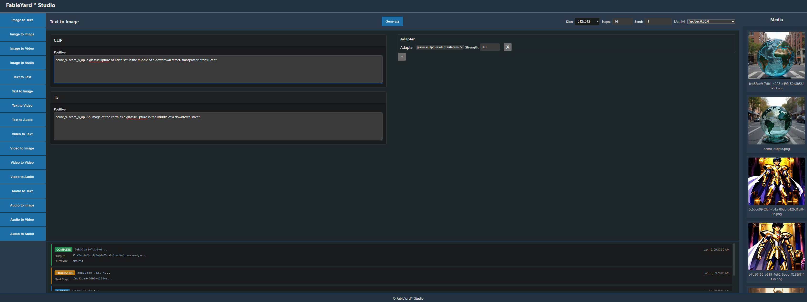

# FableYard Studio

> Generate media with locally stored AI models

[](https://github.com/FableYard/FableYard-Studio)
[](LICENSE)

**Links:** [www.fableyard.com](https://fableyard.com)

## Contents

- [About](#about)
- [Features](#features)
- [Installation](#installation)
- [Usage](#usage)
- [Roadmap](#roadmap)
- [Change Log](#change-log)
- [License](#license)

## About



FableYard Studio is a browser-based user interface for AI-powered media generation using locally stored models. It provides an intuitive, streamlined interface for local media generation.

The application runs entirely on your machine, giving you full control over your models, data, and generated content. Whether you're an artist, designer, or AI enthusiast, FableYard Studio makes advanced generative AI accessible through a clean, simple interface.

## Features

- **Text-to-Image Generation:** Create images from text prompts using Flux models
- **Local-First Architecture:** All processing happens on your machine - no cloud dependencies
- **Real-Time Progress Tracking:** WebSocket-based updates show generation progress
- **Model Management:** Organize and use multiple locally stored models
- **Modern UI:** Clean, responsive interface built with Svelte 5
- **Flexible Pipeline System:** Component-based architecture for extensible media generation
- **SafeTensors Support:** Secure model loading without pickle vulnerabilities
- **CUDA Acceleration:** GPU support for fast image generation

## Installation

### Prerequisites

- **Python 3.12+** with pip
- **NVIDIA GPU** with CUDA 12.1+ (for GPU acceleration)
- **8GB+ VRAM** recommended for image generation
- **Storage:** Several GB for models and dependencies

### Setup Steps

1. **Clone or download the repository:**
   ```bash
   git clone https://github.com/FableYard/FableYard-Studio.git
   cd fableyard-studio
   ```

2. **Set up the Python environment:**

   > This step will take a few moments to install required packages

   **Windows:**
   ```bash
   setup.bat
   ```

   **Linux/macOS:**
   ```bash
   python -m venv .venv
   source .venv/bin/activate  # On Windows: .venv\Scripts\activate
   pip install -r requirements.txt
   ```

3. **Download AI models:**

   Download HuggingFace model files and place them in the `user/models/{model_family}` directory:
   ```
   user/
   └── models/
       └── flux/ <- This directory should be pre-made
	       └── dev.0.30.0/ <- user names this directory
			   ├── tokenizer/
			   ├── tokenizer_2/
			   ├── text_encoder
			   └── text_encoder_2/
   ```

   Download Civitai checkpoint files and place them in the `user/models/{model_family}` directory:
   ```
   user/
   └── models/
       └── flux/ <- This directory should be pre-made
	       └── flux1-dev-fp8.safetensors <- user names this file if they please
   ```

4. **Start the application:**

   **Windows:**
   ```bash
   start.bat
   ```

   **Linux/macOS:**
   ```bash
   python start.py
   ```

5. **Access the UI:**

   Open your browser and navigate to:
   ```
   http://localhost:5173
   ```

   The API server runs on port 8000, and the UI dev server on port 5173.

## Usage

### Basic Workflow

1. **Select Pipeline Type**
2. **Select Model**
3. **Set Run Configuration (step count, image dimensions, etc)
4. **Enter a text prompt** describing the image you want to generate
5. **Click Generate** to start the process
6. **Monitor progress** via real-time WebSocket updates
7. **View generated images** in the Media Panel
8. **Download outputs** from the `user/output/` directory

### Project Structure

```
FableYard-Studio/
├── api/           # FastAPI backend server
├── core/          # ML pipeline and model components
├── queue/         # Background worker for processing
├── ui/            # SvelteKit frontend
├── shared/        # Shared utilities
├── user/          # User data directory
│   ├── models/    # AI model storage
│   ├── adapters/  # Adapter files
│   └── output/    # Generated images
└── start.py       # Application entry point
```

## Roadmap

Future features and enhancements planned for FableYard Studio:

- **Improved Precision** - Improve and optimize precision calculations
- **Negative Prompting** - Specify what to exclude from generated images
- **Increased Adapter Support** - Handle variants of the same model
- **Stable Diffusion 3.5** - Add support for the latest SD models
- **Pony Diffusion** - Specialized model support for stylized content
- **Text-to-Text Pipelines** - Extend beyond image generation to text tasks
- **Improve Media Panel** - Various improvements, such as reducing API calls on start 
- **Cloud Generation Option** - Cloud-based processing for users without GPUs

## Change Log

### Version 0.1.4

- Implement Linear Quadratic sigma scheduler
- Implement BaseScheduler
- Refactor FlowMatchEulerDiscrete to inherit from BaseScheduler
- Refactor VAE MidBlock to impelement missing logic

### Version 0.1.3

- Improve decoding quality

### Version 0.1.2

- Integrate Z-Image Adapter support

### Version 0.1.1

- Implement adapter support for Flux1 and Z Image model
- Refactor `/loras` endpoint to `/adapters`
- Utilize Path over hardcoded strings for directory/file paths
- Implement user configurations such as step count, seed number, etc..
- Refactor ModelSelectorService to align with AdapterSelectorService
- Update README

### Version 0.1.0

**Initial Release**
- Text-to-image generation using Flux or Z Image models
- FastAPI backend with WebSocket support for real-time progress
- SvelteKit-based responsive UI
- Component-based ML pipeline architecture
- Local model storage and management
- CUDA GPU acceleration support
- SafeTensors model format support

## License

FableYard Studio is licensed under the **GNU General Public License v3.0 (GPL-3.0)**.

This means you are free to:
- Use the software for any purpose
- Study and modify the source code
- Distribute copies of the software
- Distribute modified versions

Under the following conditions:
- Modified versions must also be licensed under GPL-3.0
- You must include the original license and copyright notices
- You must state significant changes made to the software

### Why GPL-3.0?

We chose GPL-3.0 to ensure FableYard Studio remains free and open-source while allowing us to offer commercial cloud services. This is the same license used by projects like ComfyUI.

**Important:** Running FableYard Studio as a network service does NOT require you to release your modifications. GPL-3.0 only requires source code sharing when you distribute the software itself.

---

    FableYard Studio
    Copyright (C) 2024-2025 FableYard

    This program is free software: you can redistribute it and/or modify
    it under the terms of the GNU General Public License as published by
    the Free Software Foundation, either version 3 of the License, or
    (at your option) any later version.

    This program is distributed in the hope that it will be useful,
    but WITHOUT ANY WARRANTY; without even the implied warranty of
    MERCHANTABILITY or FITNESS FOR A PARTICULAR PURPOSE.  See the
    GNU General Public License for more details.

    You should have received a copy of the GNU General Public License
    along with this program.  If not, see <https://www.gnu.org/licenses/>.

See the [LICENSE](LICENSE) file for the full text of the GNU General Public License v3.0.


